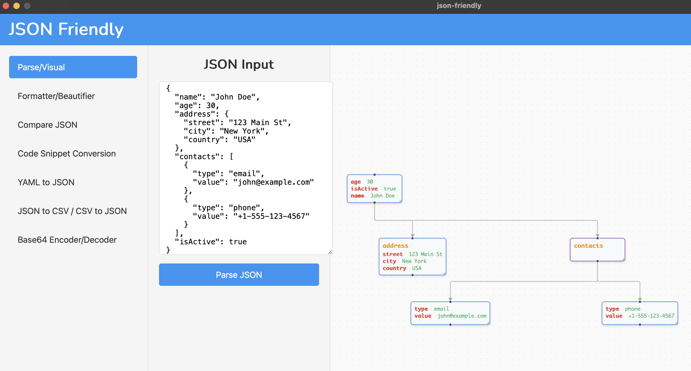

# JSON Visualizer

A desktop application built with Wails and React that visualizes JSON data in an interactive graph format. This tool helps developers and data analysts better understand complex JSON structures through visual representation.

## Features

- Interactive graph visualization of JSON structures
- Node-based representation of JSON elements
- Visual connections between related JSON nodes
- TypeScript support for better development experience
- Cross-platform desktop application (macOS, Windows)

## Installation

### Prerequisites

- Go 1.17 or later
- Node.js 14 or later
- npm or yarn
- Wails CLI

To install Wails CLI:

```bash
go install github.com/wailsapp/wails/v2/cmd/wails@latest
```

### Building from Source

1. Clone the repository:
```bash
git clone <repository-url>
cd json-visualizer
```

2. Install frontend dependencies:
```bash
cd frontend
npm install
```

3. Build the application:
```bash
wails build
```

The built application will be available in the `build/bin` directory.

## Development

1. Start the development server:
```bash
wails dev
```

This will launch the application in development mode with hot-reload enabled.

2. The frontend code is located in the `frontend` directory and uses React with TypeScript.

3. The backend Go code is in the root directory.

## Project Structure

```
├── frontend/            # React frontend application
│   ├── src/            # Source code
│   ├── wailsjs/        # Wails generated JavaScript bindings
│   └── package.json    # Frontend dependencies
├── app.go              # Backend application logic
├── main.go            # Application entry point
└── wails.json         # Wails configuration
```

## Example

Here's an example of how the JSON Visualizer works. Consider this JSON structure:

```json
{
  "squadName": "Super hero squad",
  "homeTown": "Metro City",
  "formed": 2016,
  "secretBase": "Super tower",
  "active": true,
  "members": [
    {
      "name": "Molecule Man",
      "age": 29,
      "secretIdentity": "Dan Jukes",
      "powers": [
        "Radiation resistance",
        "Turning tiny",
        "Radiation"
      ]
    },
    {
      "name": "Ahihi",
      "age": 30,
      "secretIdentity": "Dan Jukes",
      "powers": [
        "Radiation resistance",
        "Turning tiny",
        "Radiation"
      ]
    }
  ]
}
```

When visualized in the application, it creates an interactive graph like this:



The visualization shows how different elements in the JSON structure are connected, making it easier to understand complex data relationships.

## Sample Usage

Here's a sample JSON input:

```json
{
  "name": "John Doe",
  "age": 30,
  "address": {
    "street": "123 Main St",
    "city": "New York",
    "country": "USA"
  },
  "contacts": [
    {
      "type": "email",
      "value": "john@example.com"
    },
    {
      "type": "phone",
      "value": "+1-555-123-4567"
    }
  ],
  "isActive": true
}
```

When visualized, this JSON structure will be displayed as an interactive graph showing the relationships between different elements.

## Contributing

Contributions are welcome! Please feel free to submit a Pull Request.

## License

This project is licensed under the MIT License - see the LICENSE file for details.
